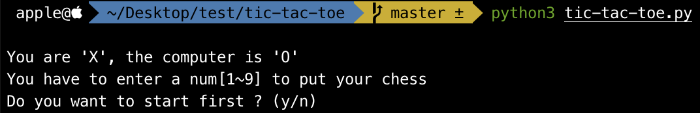
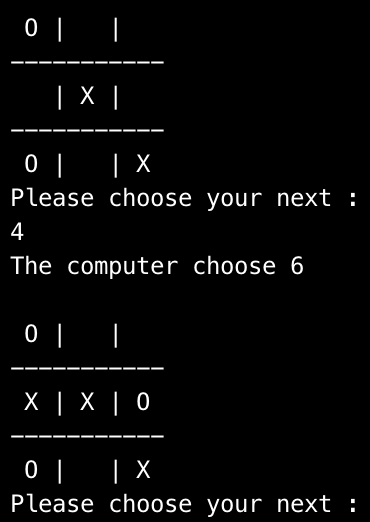

# tic-tac-toe

基于极小极大值搜索算法，采用α-β剪枝策略实现的井字棋

## Requirement

你的 Python 版本需要是 Python 3 以上

## Run

游戏是在终端进行操作，在终端输入：

```shell
python tic-tac-toe.py
```



运行之后，首先会给出游戏规则：

> You are 'X', the computer is 'O'

1. 你的棋子是 `X`，电脑 AI 的棋子是 `O`

> You have to enter a num[1~9] to put your chess

2. 轮到你下棋时，你需要输入 1 到 9 的数字来表示你下一步棋的位置。

1 到 9 的数字分别对应于棋盘：

```
    1 | 2 | 3
    4 | 5 | 6 
    7 | 8 | 9
```

> Do you want to start first ? (y/n)

3. 运行之后会问你是否先手下棋，需要输入 `y` 或者 `n` 来选择是否先手下棋。

### Screen Shot



*Have fun ~* 
